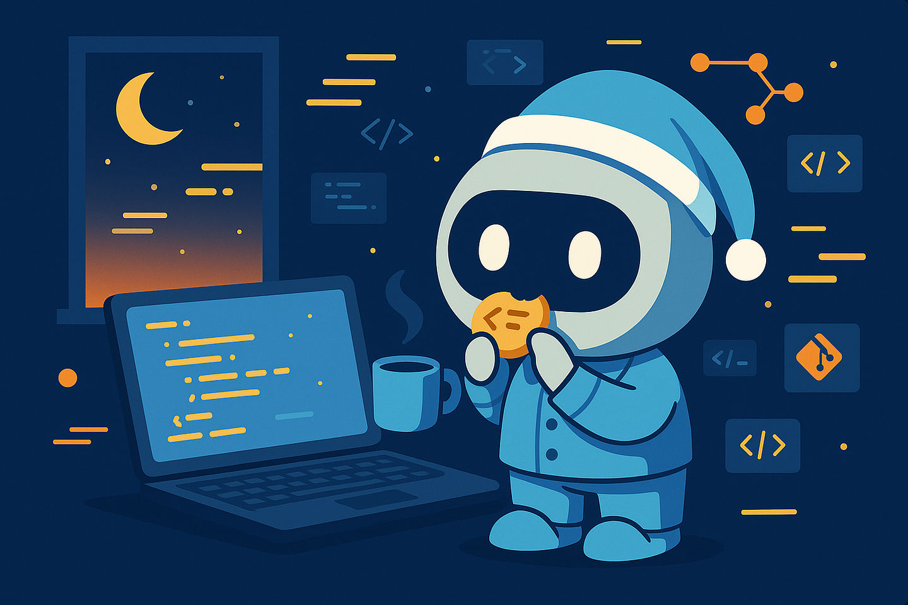

# Nibble: The AI That Improves Your Code One Bite at a Time



[](https://github.com/PatrickKalkman/nibble/stargazers) [](https://github.com/PatrickKalkman/nibble/graphs/contributors) [](https://github.com/PatrickKalkman/nibble) [](https://github.com/PatrickKalkman/nibble/issues) [](https://makeapullrequest.com) [](https://nodejs.org/)

**While you sleep, your code gets (slightly) better.**

## 🍽️ What is Nibble?

Nibble is a GitHub App that applies the Boy Scout Rule in its purest form: **leave the codebase cleaner than you found it**. Every single night.

No sweeping refactors. No risky overhauls. Just one surgical tweak—a variable renamed, a guard clause extracted, a TODO crossed off. Think compound interest for code quality.

### The Philosophy: Small Bites, Big Impact

Every developer quotes the Boy Scout Rule: leave the code cleaner than you found it. But deadlines, meetings, and entropy have other plans. Good intentions vanish when the commit clock is ticking.

**Nibble hard-codes that rule.** While you're sleeping or shipping features, it sweeps the codebase and files micro-PRs that take seconds to review and minutes to love.

## ✨ Features

- 🤖 **AI-Powered Analysis**: Uses GPT-4o-mini to analyze code improvements
- 📝 **NIBBLE Comments**: Leave `// NIBBLE:` comments for future improvements
- 🔄 **Daily Automation**: Runs automatically every night at 2 AM UTC
- 📊 **Surgical Changes**: Focuses on 1-10 line improvements only
- 🛡️ **Safe by Design**: Conservative approach with human review required
- 📈 **Compound Growth**: 1% daily improvements = 37× better code in a year
- 🎯 **Zero Risk**: Tiny changes are easy to review and rollback
- 🚀 **Easy Installation**: GitHub App installs in under 5 minutes

## 🚀 Quick Start

### 1. Install the GitHub App

Visit the [Nibble GitHub App](https://github.com/apps/nibble) and install it on your repositories.

### 2. Leave NIBBLE Comments

Add improvement hints throughout your codebase:

```javascript
// NIBBLE: This variable name could be more descriptive
const d = new Date();

// NIBBLE: Add error handling here
const userData = JSON.parse(response);

// NIBBLE: This function is getting too complex
function processPayment(user, amount, currency, merchant) {
  // 200 lines of nested logic...
}
```

### 3. Wake Up to Better Code

Every morning, check for new pull requests from Nibble. Review and merge the ones that make sense.

That's it! Your code improves automatically while you sleep.

## 🛠️ How It Works

Nibble operates on a beautifully simple principle:

1. **🕐 Cron Trigger**: Kicks off at 2 AM UTC
2. **🔍 Scan & Find**: Searches for `// NIBBLE:` comments in your repos
3. **🤖 AI Analysis**: GPT-4o-mini analyzes context and suggests improvements
4. **🌿 Create Branch**: Creates a new branch with the improvement
5. **📬 Open PR**: Creates a focused pull request for review

### Why One Change at a Time?

- **Reviewability**: One change = one decision. No cognitive overload.
- **Safety**: Single changes are easier to test and rollback if needed
- **Focus**: Each PR has a clear, singular purpose
- **Momentum**: Daily small wins beat sporadic large efforts

## 📋 Example Improvements

Nibble excels at these types of improvements:

### Better Variable Names
```javascript
// Before
const d = new Date();

// After (AI suggestion)
const currentDate = new Date();
```

### Error Handling
```javascript
// Before
const data = JSON.parse(response);

// After (AI suggestion)
try {
  const data = JSON.parse(response);
} catch (error) {
  console.error('Failed to parse response:', error);
  return null;
}
```

### Code Clarity
```python
# Before
if user != None:
    process_user(user)

# After (AI suggestion)
if user is not None:
    process_user(user)
```

## 🔧 Installation & Setup

### Prerequisites

- Node.js 18+
- OpenAI API key
- GitHub App credentials

### Local Development

1. **Clone the repository**
   ```bash
   git clone https://github.com/patrickkalkman/nibble.git
   cd nibble
   ```

2. **Install dependencies**
   ```bash
   npm install
   ```

3. **Set up environment variables**
   ```bash
   cp .env.example .env
   # Edit .env with your credentials
   ```

4. **Required Environment Variables**
   ```env
   GITHUB_APP_ID=your_app_id
   GITHUB_PRIVATE_KEY_PATH=path_to_private_key.pem
   GITHUB_WEBHOOK_SECRET=your_webhook_secret
   OPENAI_API_KEY=your_openai_api_key
   NIBBLE_API_SECRET=your_api_secret
   PORT=3000
   ```

5. **Start the server**
   ```bash
   npm start
   ```

### Deploy to Production

Nibble can be deployed to any Node.js hosting platform:

- **Railway**: One-click deploy
- **Heroku**: Uses Procfile
- **AWS Lambda**: Serverless deployment
- **DigitalOcean**: Traditional VPS

## 🎯 NIBBLE Comment Guidelines

Effective NIBBLE comments lead to better AI suggestions:

### ✅ Good NIBBLE Comments

```javascript
// NIBBLE: Variable name could be more descriptive
// NIBBLE: Add input validation
// NIBBLE: Extract this into a helper function
// NIBBLE: Add error handling for network request
// NIBBLE: Use const instead of let here
```

### ❌ Avoid These

```javascript
// NIBBLE: Rewrite everything
// NIBBLE: Fix performance issues
// NIBBLE: Make this better somehow
// NIBBLE: TODO: complicated refactor needed
```

**Best practices:**
- Be specific about the improvement needed
- Focus on small, actionable changes
- One improvement per comment
- Remove comments after they're addressed

## 🔒 Security Features

Nibble includes comprehensive security measures:

- **Rate Limiting**: Advanced IP-based rate limiting with violations tracking
- **Request Filtering**: Blocks suspicious URLs and user agents
- **Geo-blocking**: Optional country-based access control
- **Security Headers**: HSTS, CSP, and other security headers
- **Webhook Validation**: Cryptographic verification of GitHub webhooks
- **API Authentication**: Secret-based API protection

## 📊 Configuration

### AI Behavior

The AI is configured with conservative defaults:

- **Temperature**: 0.1 (consistent outputs)
- **Max Changes**: 1-10 lines typically
- **Confidence Threshold**: 70% minimum for auto-suggestions
- **Safety First**: When in doubt, AI does nothing

### Scheduling

```javascript
// Default: 2 AM UTC daily
cron.schedule('0 2 * * *', async () => {
  await nibbleService.runNightlyNibbles();
});
```

Customize the schedule by modifying the cron expression.

## 🐛 Troubleshooting

### Common Issues

**No NIBBLE comments found**
- Ensure comments start with `// NIBBLE:` or `# NIBBLE:`
- Check that the GitHub App has repository access
- Verify search indexing (new repos may take time)

**AI suggestions failing**
- Check OpenAI API key and credits
- Verify search text matches exactly (whitespace matters)
- Review AI confidence scores in logs

**Pull requests not created**
- Confirm GitHub App permissions include PR creation
- Check for existing open Nibble PRs (limit: 1 per repo)
- Review webhook delivery and authentication

### Debug Mode

Enable debug endpoints for troubleshooting:

```env
ENABLE_DEBUG_ENDPOINTS=true
```

Access debug information:
- `POST /debug/refresh-installations`
- `GET /debug/installations`

## 🤝 Contributing

We welcome contributions! Here's how to get started:

1. **Fork the repository**
2. **Create a feature branch**
   ```bash
   git checkout -b feature/amazing-feature
   ```
3. **Make your changes**
4. **Add tests** if applicable
5. **Commit your changes**
   ```bash
   git commit -m 'Add amazing feature'
   ```
6. **Push to the branch**
   ```bash
   git push origin feature/amazing-feature
   ```
7. **Open a Pull Request**

### Development Guidelines

- Follow existing code style
- Add tests for new features
- Update documentation as needed
- Use conventional commit messages

## 📝 License

This project is licensed under the MIT License - see the [LICENSE](LICENSE) file for details.

## 🙏 Acknowledgments

- OpenAI for GPT-4o-mini model
- GitHub for the Apps platform
- The open source community for inspiration

## 📞 Support

- **Issues**: [GitHub Issues](https://github.com/patrickkalkman/nibble/issues)
- **Discussions**: [GitHub Discussions](https://github.com/patrickkalkman/nibble/discussions)
- **Email**: support@nibble.dev

---

**Ready to try Nibble on your own code?** Install it in under 5 minutes and start making your codebase slightly better, one bite at a time. 🍽️

*Because the best way to eat an elephant isn't a bigger fork—it's 365 consistent bites.*